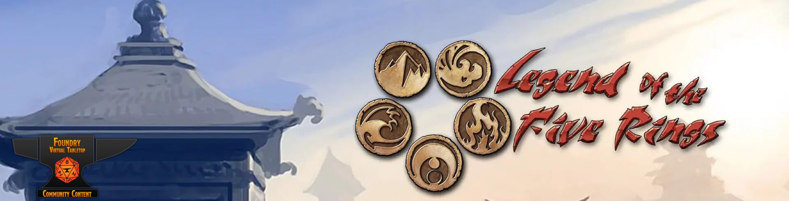

# Unofficial L5R 4th Edition System for Foundry VTT 

Unofficial implementation of the Legend of the Five Rings 4th edition for Foundry VTT. Provides character sheets for pcs and npcs.

### Features

- Trait rolls, ring rolls, spellcasting rolls, skill rolls and damage rolls from the character sheet.
- Enforces the "Ten dice rule" for rolls from the character sheet.
- Automatically calculates derived attributes such as initiative, Armor TN and rings.
- Automatically calculates the current would level based on the wounds suffered.
- A simplified sheet for npcs with rollable attacks, skills and damage.

## Available languages

- English
- Español
- Français 

## Installation

The recommended installation method is with the usual FoundryVTT installer (see the foundry [tutorial](https://foundryvtt.com/article/tutorial/)). This system is listed as https://foundryvtt.com/packages/l5r4.

Manifest: https://gitlab.com/team-l5r4/l5r4/-/raw/master/system.json

Alternatively you can download this repo into your foundry data: `your_foundry_data_path/systems/`

## Recomended modules

The L5R4ed dice rolles allows for rolls directly into the chat for quick rolls that are not covered by the system
https://github.com/eupolemo/fvtt-l5r4ed-dice-roller

Compatible with Dice So Nice!
https://gitlab.com/riccisi/foundryvtt-dice-so-nice

## Special thanks to contributors

Sylvain «Greewi» Dumazet
Roberto Lorite
Teddy

## License

All icons and images are property of their respective owners.

[Samurai icons created by Freepik - Flaticon](https://www.flaticon.com/free-icons/samurai "samurai icons")

This work is licensed under a GNU General Public License v3.0 and [Foundry Virtual Tabletop EULA - Limited License Agreement for module development.](https://foundryvtt.com/article/license/)